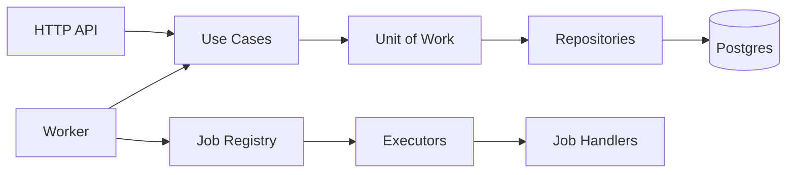
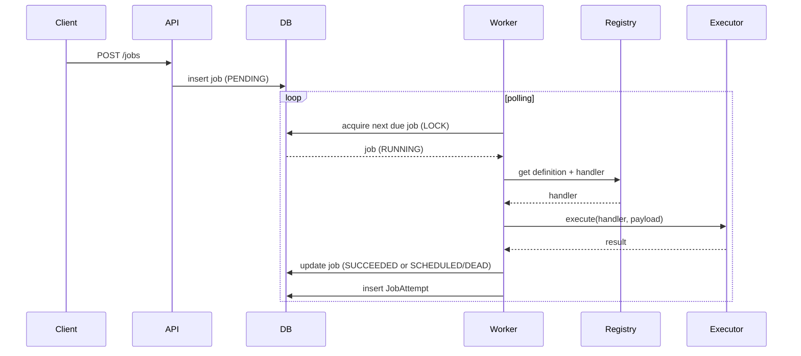
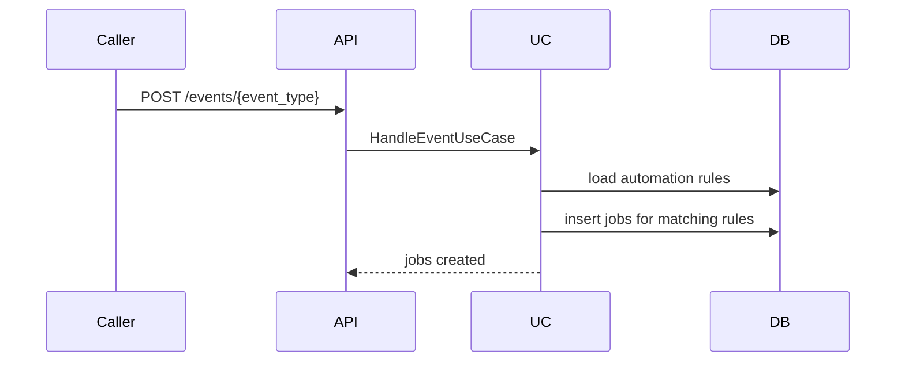

# TaskFlow Features and End-to-End Flow

This document explains the current features and how the system behaves end to end.
It is written for demos, presentations, and onboarding.

## Layers and responsibilities

- Domain: pure business rules and state transitions.
- Application: use cases and orchestration through ports.
- Adapters: API, DB, registries, and executors.
- Worker: polling and execution loop.

## Core entities

- Job: a durable run instance with lifecycle and scheduling metadata.
- JobAttempt: a single execution attempt for auditability.
- JobDefinition: metadata for how to execute a job.
- AutomationRule: triggers that create jobs.
- Queue and Tenant: concurrency limits and fairness.

## Job lifecycle (happy path)

1) Schedule a job (API or internal automation rule).
2) Worker acquires due job and locks it (lease).
3) Worker executes job via registry + executor.
4) Job is marked SUCCEEDED and a JobAttempt is recorded.

State transitions:
- PENDING -> RUNNING -> SUCCEEDED

## Job lifecycle (failure + retry)

1) Job runs and fails.
2) Failure increments attempts and applies retry policy.
3) If attempts remain, state becomes SCHEDULED with next_run_at.
4) If attempts exhausted, state becomes DEAD.

State transitions:
- PENDING -> RUNNING -> SCHEDULED -> RUNNING -> ... -> DEAD

## Scheduling and acquisition

- Jobs are selected by queue, state, priority, and next_run_at.
- Acquisition is atomic and uses row-level locking.
- Jobs are leased to a worker for a visibility timeout.

Queue and tenant fairness:
- Queue max_concurrency is enforced during acquisition.
- Tenant max_running_jobs is enforced during acquisition.

## Automation rules

- AutomationRule has trigger, conditions, and actions.
- Triggers: CRON, WEBHOOK, INTERNAL_EVENT.
- When triggered, rules generate jobs and persist them.

## Registries and execution modes

Registry answers: "Given a job name, how do I run it?"

- Plugin registry: in-memory, code-defined jobs.
- DB registry: runtime job definitions.
- Hybrid registry: plugin + DB with override policy.

Executors:
- python_async (default)
- thread_pool
- http

## Worker loop (end to end)

1) Acquire next due job from DB.
2) Resolve job definition and handler.
3) Select executor by execution_mode.
4) Execute the job.
5) Mark job succeeded or failed.
6) Persist JobAttempt.
7) Heartbeat extends lease while running.

## Events and integrations

- Event bus port exists for job created/started/completed/failed/dead.
- Default adapter logs events (can be replaced by broker).
- Inbound events can trigger automation rules via HTTP.

## HTTP API surface (current)

- POST /jobs
- GET /jobs/{id}
- POST /automation-rules
- GET /automation-rules
- GET /automation-rules/{id}
- PUT /automation-rules/{id}
- DELETE /automation-rules/{id}
- POST /events/{event_type}

## End-to-end diagram (system)

## End-to-end diagram (job execution)

## End-to-end diagram (automation)

